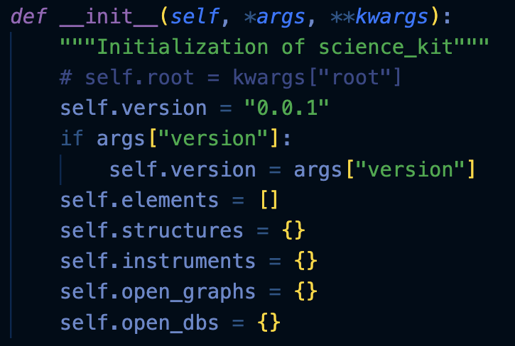
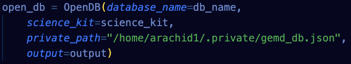
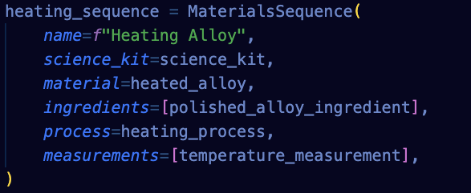
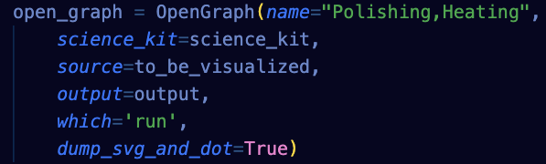

=============
Science Kit
=============

ScienceKit is designed to encompass the entire knowledge of the science kit, capturing not only the model itself, but structures that are built from them like MaterialSequences, any open graphs that are generated, or db engines that are opened during its use. Additionally, ScienceKit provides versioning capabilities, allowing users to track changes and manage different versions of the model and generated graphs over time. This comprehensive approach ensures that all aspects of the scientific kit, from its initial design to its experimental results, are well-documented and easily accessible for analysis and further experimentation.

The definition of a science kit is meant to be flexible to the needs of the user, allowing workflows to be composed to construct even larger GEMD graphs. The **build()** method is meant to be overwritten by child objects of ScienceKit that correspond to a specific science kit or user case.

The **dumps()** method dumps the entire model into a JSON per object, each representing the 'thin' version of the object in which pointers (i.e., true value) are replaced by links (e.g., uuid). 

The class also includes methods for loading models (**loads()**) from JSONs, as well as an out() method to run on individual items during recursion.

The **from_spec_or_run()** class method is used to initialize a ScienceKit object from a spec or a run, adding on all its connected components, providing powerful ways to create objects. 

When instantiating any structure, instrument, Open Graph, or Open Db, you can pass the `science_kit` argument. That will auto-populate the respective fields structures, instruments, open_graphs and open_dbs, all dictionaries with the object name as the key. This way, your science kit has traces of all the elements generated!

Overall, ScienceKit provides a powerful tool for modeling and managing scientific kits within the GEMD data model, offering flexibility and utility for a wide range of scientific applications.